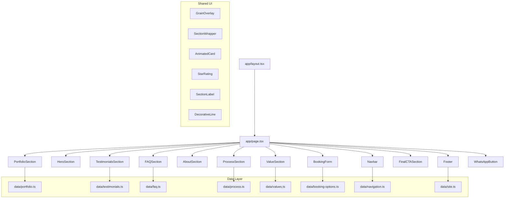

# Design Document: YumeTattoo Landing Page — Premium Creative Redesign

## Overview

This design document describes the architecture and implementation plan for a **complete creative redesign** of the YumeTattoo premium tattoo studio landing page. The goal is to transform the site from a generic template aesthetic into a **$2000+ premium creative studio project** — cinematic, editorial, and luxurious.

The application is a single-page Next.js 14+ site (App Router) built with React 18+, TypeScript, Tailwind CSS, Framer Motion, and lucide-react. The page is a conversion-focused commercial demo that should feel like a high-end fashion or perfume brand website adapted for a tattoo studio.

### Creative Direction

The redesign is driven by these core principles:

1. **Cinematic, editorial composition** — Every section feels like a spread from a luxury magazine. Asymmetric layouts, dramatic typography, and intentional negative space replace the centered-everything template look.
2. **Deep black atmosphere** — True `#000000` backgrounds with dramatic light and shadow. Radial glows, grain textures, and gradient meshes create depth without images.
3. **Typography with personality** — Playfair Display (serif) at massive scales (text-7xl to text-9xl) for headlines, mixed with Inter (sans-serif) for body. Editorial treatments: mixed sizes, weights, and line-by-line staggered reveals.
4. **Luxury brand feel** — Thin gold decorative lines, generous whitespace (py-32 to py-40 between sections), numbered sections, pull quotes, and horizontal rules create the rhythm of a high-end brand.
5. **Motion as storytelling** — Framer Motion throughout: staggered text reveals (line by line), fade + translate entrances, parallax-like scroll effects on decorative elements, and microinteractions on every interactive element. Smooth and elegant — never exaggerated.

### Key Design Decisions

1. **Asymmetric hero layout**: Text on one side, decorative visual element on the other. No centered title. Editorial magazine feel from the first second.
2. **Horizontal scrolling portfolio carousel**: Instead of a basic grid, portfolio pieces are displayed in a draggable horizontal carousel with large cards. Each piece feels curated, like an art exhibition.
3. **Two-column booking form with visual element**: The form sits alongside a decorative visual panel. Floating labels, minimal borders, large clean inputs — creative studio style.
4. **Grain/noise texture overlay**: A subtle SVG-based noise texture overlays the entire page via a fixed pseudo-element, adding analog warmth to the digital surface.
5. **Section numbering and editorial rhythm**: Sections use numbered labels (01, 02, 03...) as decorative elements, creating visual rhythm and a sense of curated progression.
6. **Full-width / contained alternation**: Some sections span full viewport width, others are contained. This breaks the rigid template feel and creates visual variety.
7. **Split layouts (50/50 and 60/40)**: About, Process, and Form sections use asymmetric split layouts instead of centered content blocks.
8. **All content in Spanish** as specified in requirements.
9. **No external image assets**: Portfolio and avatar placeholders use CSS gradients, SVG patterns, and decorative elements.
10. **Same data files and TypeScript types**: The redesign changes visual/structural approach, not the data layer.

### Anti-Patterns Avoided

- Generic Tailwind template look
- Basic card grids with uniform spacing
- Centered-everything layouts
- Boring text blocks without typographic treatment
- Square blocks without intention
- Default-looking form inputs
- Repetitive section layouts

## Architecture

### High-Level Architecture



### Project Structure

```
├── app/
│   ├── layout.tsx          # Root layout: fonts, metadata, grain overlay, global styles
│   ├── page.tsx            # Main page composing all sections
│   └── globals.css         # Tailwind directives, CSS variables, grain texture, custom utilities
├── components/
│   ├── Navbar.tsx           # Minimal luxury navbar with editorial logo treatment
│   ├── HeroSection.tsx      # Asymmetric editorial hero with dramatic typography
│   ├── ValueSection.tsx     # Numbered value cards with editorial layout
│   ├── PortfolioSection.tsx # Horizontal scroll carousel with large curated cards
│   ├── AboutSection.tsx     # 60/40 split layout with pull quote
│   ├── ProcessSection.tsx   # Vertical editorial timeline with numbered steps
│   ├── BookingForm.tsx      # Two-column form with visual panel, floating labels
│   ├── TestimonialsSection.tsx # Editorial testimonial layout with large quotes
│   ├── FAQSection.tsx       # Minimal accordion with gold accents
│   ├── FinalCTASection.tsx  # Dramatic full-width CTA with gradient mesh
│   ├── Footer.tsx           # Minimal luxury footer
│   ├── WhatsAppButton.tsx   # Floating WhatsApp with premium hover
│   └── ui/
│       ├── GrainOverlay.tsx     # Fixed grain/noise texture overlay
│       ├── SectionWrapper.tsx   # Reusable section with scroll animation + dramatic spacing
│       ├── SectionLabel.tsx     # Numbered section label (e.g., "01 — PORTAFOLIO")
│       ├── DecorativeLine.tsx   # Thin gold horizontal/vertical decorative line
│       ├── AnimatedCard.tsx     # Card with entrance + hover animations
│       └── StarRating.tsx       # Star display for testimonials
├── data/                    # (unchanged — same mock data files)
├── types/                   # (unchanged — same TypeScript interfaces)
├── tailwind.config.ts       # Extended with new spacing, animation tokens
└── ...
```

### Rendering Strategy

- `app/layout.tsx`: Server component. Sets `<html lang="es">`, loads Playfair Display + Inter via `next/font/google`, applies true black background. Includes `<GrainOverlay />` as a fixed overlay across the entire page.
- `app/page.tsx`: Server component composing all section components in order.
- Each section component: `"use client"` directive for Framer Motion animations and interactive state.
- `SectionWrapper`: Shared client component with Framer Motion `whileInView` entrance animation, dramatic vertical padding (`py-32 md:py-40`), and consistent max-width.


## Components and Interfaces

### New Shared UI Components

#### GrainOverlay

A fixed, full-viewport overlay that adds subtle film grain/noise texture to the entire page. This is the single most impactful element for breaking the "digital template" feel.

**Implementation:**
- Renders a `<div>` with `fixed inset-0 z-[100] pointer-events-none` so it covers everything but doesn't block interaction.
- Uses an inline SVG filter with `<feTurbulence>` (type="fractalNoise", baseFrequency ~0.65, numOctaves 3) and `<feColorMatrix>` to generate procedural noise.
- The overlay div has `opacity: 0.03` to `0.05` — barely visible but adds analog warmth.
- Applied via CSS `background-image: url("data:image/svg+xml,...")` or an SVG filter reference.
- Alternative: a CSS `::after` pseudo-element on `<body>` in `globals.css` using an SVG noise pattern as background-image with `mix-blend-mode: overlay`.

```css
/* globals.css approach */
body::after {
  content: "";
  position: fixed;
  inset: 0;
  z-index: 100;
  pointer-events: none;
  opacity: 0.04;
  background-image: url("data:image/svg+xml,%3Csvg viewBox='0 0 256 256' xmlns='http://www.w3.org/2000/svg'%3E%3Cfilter id='noise'%3E%3CfeTurbulence type='fractalNoise' baseFrequency='0.65' numOctaves='3' stitchTiles='stitch'/%3E%3C/filter%3E%3Crect width='100%25' height='100%25' filter='url(%23noise)'/%3E%3C/svg%3E");
  background-repeat: repeat;
}
```

#### SectionLabel

Decorative numbered section label used at the top of each major section to create editorial rhythm.

**Props:**
- `number: string` — e.g., "01", "02"
- `label: string` — e.g., "PORTAFOLIO", "PROCESO"

**Rendering:**
- Displays as: `01 — PORTAFOLIO` in uppercase, small text (`text-xs tracking-[0.3em]`), gold color (`text-gold`).
- A thin horizontal gold line extends from the text (`w-12 h-px bg-gold/40 inline-block ml-4`).
- Uses `font-body` (Inter) for clean sans-serif look.

#### DecorativeLine

Thin gold decorative line used as visual punctuation between content blocks.

**Props:**
- `orientation?: "horizontal" | "vertical"` (default: "horizontal")
- `className?: string`

**Rendering:**
- Horizontal: `w-16 h-px bg-gold/30`
- Vertical: `w-px h-16 bg-gold/30`
- Can be positioned absolutely for decorative placement.

#### SectionWrapper (Redesigned)

Reusable container with dramatically increased spacing and scroll-triggered entrance animation.

**Props:**
- `id?: string` — HTML id for anchor navigation
- `children: React.ReactNode`
- `className?: string`
- `animate?: boolean` — whether to apply entrance animation (default: `true`)
- `fullWidth?: boolean` — if true, removes max-width constraint for full-bleed sections

**Behavior:**
- Renders a `<section>` element with `id`.
- Default: `max-w-7xl mx-auto px-6 sm:px-8 lg:px-12` with dramatic vertical padding `py-32 md:py-40`.
- When `fullWidth`: removes max-width, keeps padding.
- Uses Framer Motion `motion.section` with `whileInView` to trigger fade-in + translateY(30px→0) with `once: true`, `viewport.amount: 0.15`.
- Transition: `duration: 0.8, ease: [0.25, 0.1, 0.25, 1]` (custom cubic bezier for luxury feel).

#### AnimatedCard (Redesigned)

**Props:**
- `children: React.ReactNode`
- `className?: string`
- `delay?: number`
- `hoverEffect?: boolean` (default: `true`)

**Behavior:**
- Uses `motion.div` with `whileInView` for entrance (fade-in + slide-up, duration 0.7s).
- On hover: `whileHover={{ y: -6, transition: { duration: 0.3 } }}` with a subtle gold border glow (`box-shadow: 0 0 30px rgba(201,169,110,0.08)`).
- No basic zoom — uses overlay reveals and subtle elevation shifts.

#### StarRating (unchanged)

Displays a row of filled/empty star icons using lucide-react `Star`.

**Props:**
- `rating: number` (1–5)
- `size?: number` (default 16)

### Section Components — Complete Creative Redesign

---

#### Navbar — Minimal Luxury

**State:**
- `scrolled: boolean` — scroll > 50px triggers backdrop
- `mobileMenuOpen: boolean`

**Visual Design:**
- Fixed top, full width, z-50.
- Default: fully transparent. When scrolled: `bg-black/90 backdrop-blur-xl border-b border-white/5`.
- Height: 80px (taller than typical for luxury feel).
- Logo: "YumeTattoo" in `font-heading text-lg tracking-[0.15em] uppercase` — not just a name, but a brand mark. Gold color on hover.
- Desktop nav links: `text-xs tracking-[0.2em] uppercase text-text-muted hover:text-text-primary` — minimal, spaced out.
- CTA button: `border border-gold/50 text-gold hover:bg-gold/10 text-xs tracking-[0.15em] uppercase px-6 py-2.5` — outlined, not filled. Luxury brands don't scream.
- Mobile: hamburger icon (thin lines, not chunky). Full-screen overlay with centered nav links in large `font-heading` text, staggered entrance animation.

**Data:** Imports `navLinks` from `data/navigation.ts`.

---

#### HeroSection — Asymmetric Editorial Composition

This is the most critical section. It must feel like a fashion editorial spread, not a template hero.

**Layout:**
- Full viewport height: `min-h-screen`.
- **Asymmetric two-column layout** on desktop: text content on the left (60%), decorative visual element on the right (40%).
- Mobile: stacked, text first, visual element below (or hidden).
- Content is NOT centered. It's left-aligned with dramatic left padding.

**Typography Treatment:**
- Title split across multiple lines, each line animated separately (staggered reveal).
- Line 1: "Tatuajes con" — `text-5xl md:text-7xl lg:text-8xl xl:text-9xl font-heading font-bold text-text-primary`
- Line 2: "identidad," — same size, but with `text-gold` color on "identidad" for emphasis
- Line 3: "precisión y carácter." — same size
- Each line fades in + translates up with 0.15s stagger between lines.
- Subtitle below in `text-lg md:text-xl text-text-secondary max-w-lg` — left-aligned, not centered.

**Decorative Elements (Right Side):**
- A large abstract decorative composition:
  - Radial gradient glow (`bg-wine-red/8 blur-[150px]`) — large, atmospheric
  - Thin gold lines at various angles (absolute positioned `div` elements rotated with `transform: rotate()`)
  - A large outlined circle or arc shape using `border border-gold/15 rounded-full` — purely decorative
  - Subtle animated elements: a gold line that slowly translates, a circle that pulses opacity
- These elements create visual weight on the right without needing images.

**CTA Buttons:**
- Positioned below subtitle, left-aligned.
- "Reservar cita": `bg-wine-red hover:bg-wine-red-light text-white px-8 py-3.5 text-sm tracking-wide` — primary action.
- "Ver portafolio": `border border-white/20 text-text-primary hover:border-gold/50 hover:text-gold px-8 py-3.5 text-sm tracking-wide` — secondary, outlined.
- Both with `transition-all duration-300`.

**Animation Sequence (within 1.5s):**
1. Line 1 fades in (0s delay, 0.6s duration)
2. Line 2 fades in (0.15s delay)
3. Line 3 fades in (0.3s delay)
4. Subtitle fades in (0.5s delay)
5. CTA buttons fade in (0.7s delay)
6. Decorative elements fade in with slight parallax (0.4s delay, slower duration)

**Background:**
- True `#000000` with a very subtle radial gradient from `wine-red/5` at center.
- Grain overlay from GrainOverlay component adds texture.

---

#### ValueSection — Editorial Numbered Cards

**Layout:**
- Section label: `<SectionLabel number="01" label="BENEFICIOS" />`
- Heading: "¿Por qué elegirnos?" in `font-heading text-4xl md:text-5xl lg:text-6xl` — left-aligned, not centered.
- A thin gold `<DecorativeLine />` below the heading.
- Cards in a responsive grid: `grid-cols-1 md:grid-cols-2 lg:grid-cols-3 gap-8 md:gap-10`.

**Card Design (NOT basic cards):**
- Each card has a subtle top border: `border-t border-gold/20 pt-8`.
- No background fill — transparent, letting the black breathe through.
- Icon: lucide-react icon in `text-gold w-8 h-8 mb-4` — not inside a colored circle, just the icon itself.
- Title: `font-heading text-xl text-text-primary mb-3`.
- Description: `text-text-secondary text-sm leading-relaxed`.
- Hover: the top border transitions to `border-gold/60` and the card subtly translates up (`y: -4`).
- Staggered entrance: each card delays by `index * 0.1s`.

**Data:** Imports `values` from `data/values.ts`.

---

#### PortfolioSection — Horizontal Scroll Carousel

This replaces the basic grid with an art-exhibition-style horizontal carousel.

**State:**
- `activeCategory: string` (default: "Todos")

**Layout:**
- Section label: `<SectionLabel number="02" label="PORTAFOLIO" />`
- Heading: "Portafolio" in `font-heading text-4xl md:text-5xl lg:text-6xl` — left-aligned.
- Subheading: "Cada pieza cuenta una historia" in `text-text-secondary`.
- Category filter buttons below heading, left-aligned (not centered).
- Filter buttons: `text-xs tracking-[0.2em] uppercase` — active button gets `text-gold border-b border-gold`, inactive gets `text-text-muted hover:text-text-secondary`. No pill backgrounds — just text with underline.

**Horizontal Carousel:**
- A horizontally scrollable container: `overflow-x-auto` with `scroll-snap-type: x mandatory`.
- Uses Framer Motion `motion.div` with `drag="x"` and `dragConstraints` for smooth dragging.
- Cards are large: `min-w-[300px] md:min-w-[400px] lg:min-w-[450px]` with `aspect-[3/4]` (portrait orientation, like art prints).
- Gap between cards: `gap-6 md:gap-8`.
- Container has `px-6` padding and extends beyond the max-width container for a full-bleed feel.
- Hide scrollbar: `scrollbar-hide` utility class (`::-webkit-scrollbar { display: none }`).
- A subtle gradient fade on the right edge indicates more content.

**Card Design:**
- Each card: `rounded-2xl overflow-hidden relative` with the CSS gradient as background.
- Overlay: a gradient from transparent to `black/70` at the bottom, always visible (not just on hover).
- On hover: the gradient background subtly shifts/scales (`scale: 1.05` over 0.6s), and a thin gold border appears (`border border-gold/30`).
- Title: `font-heading text-lg text-white` at bottom-left of card.
- Category: `text-xs tracking-[0.2em] uppercase text-gold/80` above the title.
- A small arrow icon appears on hover, suggesting "view more".

**Filter Animation:**
- `AnimatePresence mode="wait"` wraps the carousel. Changing category triggers a smooth fade transition.

**Data:** Imports `portfolioItems` from `data/portfolio.ts`.

---

#### AboutSection — 60/40 Split with Pull Quote

**Layout:**
- Section label: `<SectionLabel number="03" label="EL ARTISTA" />`
- Desktop: `grid grid-cols-1 lg:grid-cols-5 gap-16` — left column (2/5) for avatar, right column (3/5) for text.
- Mobile: stacked, avatar above text.

**Left Column — Avatar:**
- Large placeholder: `aspect-[3/4] rounded-2xl` with a sophisticated gradient (dark purple to deep blue).
- Overlaid with a thin gold border: `border border-gold/20`.
- Artist initials "AM" in large `font-heading text-6xl text-gold/20` centered in the gradient.
- A decorative gold line extends below the avatar.

**Right Column — Biography:**
- Artist name: `font-heading text-3xl md:text-4xl text-text-primary mb-2`.
- Title: `text-gold text-sm tracking-[0.2em] uppercase mb-8`.
- Bio paragraphs: `text-text-secondary leading-relaxed text-base` with `mb-6` between paragraphs.
- **Pull quote** (philosophy): displayed as a large, indented quote with `border-l-2 border-gold/40 pl-6 my-10`. Text in `font-heading text-xl md:text-2xl text-text-primary italic`. This is a key editorial element.
- Years of experience: `text-gold text-5xl font-heading font-bold` with "años de experiencia" in small text below — a dramatic stat callout.

**Data:** Imports `artistBio` from `data/site.ts`.

---

#### ProcessSection — Vertical Editorial Timeline

**Layout:**
- Section label: `<SectionLabel number="04" label="PROCESO" />`
- Heading: "Nuestro proceso" in `font-heading text-4xl md:text-5xl lg:text-6xl`.
- Desktop: a vertical timeline with steps alternating left/right (or all on one side with a vertical gold line).
- Mobile: vertical stack with connecting line on the left.

**Timeline Design:**
- A thin vertical gold line (`w-px bg-gold/20`) runs down the center (desktop) or left side (mobile).
- Each step is a row with: step number on the line, content to the side.
- Step number: `text-gold font-heading text-4xl md:text-5xl font-bold opacity-30` — large, decorative, semi-transparent.
- Step content: title in `font-heading text-xl text-text-primary`, description in `text-text-secondary text-sm leading-relaxed`.
- Icon: lucide-react icon in `text-gold/60 w-6 h-6` next to the title.
- Each step animates in with staggered delay (`index * 0.2s`), sliding in from the side.

**Data:** Imports `processSteps` from `data/process.ts`.

---

#### BookingForm — Two-Column Creative Studio Style

**State:**
- `formData: BookingFormData`
- `errors: Partial<Record<keyof BookingFormData, string>>`
- `status: 'idle' | 'submitting' | 'success'`

**Layout:**
- Section label: `<SectionLabel number="05" label="RESERVAR" />`
- Heading: "Solicita tu evaluación" in `font-heading text-4xl md:text-5xl lg:text-6xl`.
- Desktop: `grid grid-cols-1 lg:grid-cols-2 gap-16` — form on the left, decorative visual panel on the right.
- Mobile: form only, visual panel hidden.

**Form Design (Left Column):**
- NO typical form inputs. Creative studio style:
- Each input: `bg-transparent border-b border-white/15 focus:border-gold py-4 text-text-primary text-base placeholder:text-text-muted/50 transition-colors duration-300 outline-none w-full` — bottom-border-only inputs, clean and minimal.
- Labels: `text-xs tracking-[0.15em] uppercase text-text-muted mb-2 block` — small, uppercase, spaced.
- Select elements: same bottom-border style with custom dropdown arrow (gold chevron).
- Textarea: same style but with a subtle `border border-white/10 rounded-lg p-4` for the description field (needs more space).
- Error messages: `text-error-red text-xs mt-1` — minimal, inline.
- Submit button: `w-full bg-gold text-black font-medium py-4 text-sm tracking-[0.15em] uppercase hover:bg-gold-light transition-all duration-300 mt-8` — gold background, black text. Premium feel.
- Form fields grouped with generous spacing (`space-y-8`).

**Visual Panel (Right Column, Desktop Only):**
- A decorative composition that mirrors the hero's right side:
  - Large radial gradient glow (`bg-wine-red/5 blur-[120px]`)
  - Thin gold lines at angles
  - A large pull quote: "Tu próximo tatuaje empieza con una conversación." in `font-heading text-3xl text-text-primary/20 italic` — large, semi-transparent, decorative.
  - Decorative outlined shapes (circles, arcs) in `border-gold/10`.

**Success State:**
- Full section transforms into a centered success message with `CheckCircle` icon in gold, heading "¡Solicitud enviada!", and supporting text. Entrance animation: scale(0.95→1) + fade-in.

**Data:** Imports `bookingOptions` from `data/booking-options.ts`.

---

#### TestimonialsSection — Editorial Quote Layout

**Layout:**
- Section label: `<SectionLabel number="06" label="TESTIMONIOS" />`
- Heading: "Lo que dicen nuestros clientes" in `font-heading text-4xl md:text-5xl lg:text-6xl`.
- NOT a basic card grid. Instead, an editorial layout:
  - Desktop: `grid grid-cols-1 md:grid-cols-2 gap-12 md:gap-16`.
  - Each testimonial is a text-forward block, not a boxed card.

**Testimonial Design:**
- Large opening quotation mark: `"` in `font-heading text-6xl text-gold/30 leading-none` — decorative, positioned above the text.
- Review text: `font-heading text-lg md:text-xl text-text-primary italic leading-relaxed` — the quote IS the visual element, not hidden in a small card.
- Below the quote: a thin gold line (`w-12 h-px bg-gold/40`).
- Client name: `text-text-secondary text-sm tracking-[0.1em] uppercase mt-4`.
- Star rating: `StarRating` component in gold, below the name.
- Staggered entrance animation per testimonial.

**Data:** Imports `testimonials` from `data/testimonials.ts`.

---

#### FAQSection — Minimal Accordion with Gold Accents

**State:**
- `openIndex: number | null`

**Layout:**
- Section label: `<SectionLabel number="07" label="FAQ" />`
- Heading: "Preguntas frecuentes" in `font-heading text-4xl md:text-5xl lg:text-6xl`.
- Accordion list: `max-w-3xl` (not centered with `mx-auto` — left-aligned on desktop for editorial feel, or centered for readability).

**Accordion Design:**
- Each item separated by `border-b border-white/10`.
- Question: `text-text-primary text-base md:text-lg py-6 flex justify-between items-center cursor-pointer hover:text-gold transition-colors duration-200`.
- Chevron icon: `text-gold/60` — rotates 180° when open, smooth transition.
- Answer: Framer Motion `AnimatePresence` with height animation (0 → auto), `text-text-secondary text-sm leading-relaxed pb-6`.
- Only one item open at a time. Clicking open item collapses it.

**Data:** Imports `faqItems` from `data/faq.ts`.

---

#### FinalCTASection — Dramatic Full-Width Statement

**Layout:**
- Full-width section (no max-width constraint) with dramatic background.
- Background: gradient mesh effect — overlapping radial gradients (`bg-wine-red/8` and `bg-gold/5`) with blur, creating a warm atmospheric glow over the black.
- Content centered: `max-w-3xl mx-auto text-center`.

**Content:**
- Heading: "Tu próximo tatuaje empieza aquí" in `font-heading text-4xl md:text-6xl lg:text-7xl text-text-primary`.
- Supporting text: `text-text-secondary text-lg md:text-xl max-w-xl mx-auto mt-6`.
- Two CTA buttons with generous spacing:
  - "Reservar cita": `bg-gold text-black px-10 py-4 text-sm tracking-[0.15em] uppercase hover:bg-gold-light`.
  - "Contactar por WhatsApp": `border border-whatsapp-green/50 text-whatsapp-green px-10 py-4 text-sm tracking-[0.15em] uppercase hover:bg-whatsapp-green/10`.
- Entrance: fade-in + scale(0.95→1).

---

#### Footer — Minimal Luxury

**Layout:**
- `bg-black border-t border-white/5 py-20`.
- Three-column grid on desktop, stacked on mobile.
- Column 1: "YumeTattoo" in `font-heading text-xl tracking-[0.15em] uppercase` + tagline in `text-text-muted text-sm mt-2`.
- Column 2: Address + hours in `text-text-muted text-sm leading-relaxed`.
- Column 3: Social links (Instagram, WhatsApp) as `text-text-muted hover:text-gold text-sm` with lucide-react icons.
- Bottom: copyright with dynamic year, separated by a thin `border-t border-white/5 mt-12 pt-6`.
- Everything in `text-xs tracking-[0.1em] uppercase text-text-muted`.

**Data:** Imports `siteInfo` from `data/site.ts`.

---

#### WhatsAppButton — Premium Floating Action

**Behavior:**
- Fixed: `fixed bottom-8 right-8 z-50` (slightly more padding than typical).
- Green circle: `bg-whatsapp-green w-14 h-14 rounded-full flex items-center justify-center` with `shadow-lg shadow-whatsapp-green/20`.
- Icon: `MessageCircle` from lucide-react in white, `w-6 h-6`.
- Hover: `scale(1.1)` + tooltip "¿Hablamos?" appearing as a small pill to the left with fade-in. Tooltip: `bg-black/90 text-text-primary text-xs px-3 py-1.5 rounded-full`.
- Click: opens `wa.me` URL in new tab.
- Touch target: 56×56px (exceeds 48px minimum).
- Uses `motion.a` for smooth hover animation.


## Data Models

All TypeScript interfaces remain **unchanged** from the existing implementation in `types/index.ts`. The redesign is purely visual and structural — the data layer is identical.

```typescript
// types/index.ts (unchanged)
export interface NavLink { label: string; href: string; }
export interface ValueItem { icon: string; title: string; description: string; }
export interface PortfolioItem { id: string; title: string; category: PortfolioCategory; gradient: string; }
export type PortfolioCategory = "Realismo" | "Blackwork" | "Lettering" | "Minimalista";
export interface ProcessStep { number: number; icon: string; title: string; description: string; }
export interface Testimonial { id: string; name: string; rating: number; text: string; }
export interface FAQItem { question: string; answer: string; }
export interface BookingFormData { name: string; whatsapp: string; tattooType: string; size: string; bodyArea: string; description: string; budget: string; }
export interface SelectOption { value: string; label: string; }
export interface BookingOptions { tattooTypes: SelectOption[]; sizes: SelectOption[]; budgets: SelectOption[]; }
export interface SiteInfo { studioName: string; tagline: string; address: string; hours: string; phone: string; whatsappUrl: string; instagramUrl: string; }
export interface ArtistBio { name: string; title: string; bio: string[]; philosophy: string; yearsExperience: number; }
```

### Tailwind Configuration — Extended Design Tokens

```typescript
// tailwind.config.ts
import type { Config } from "tailwindcss";

const config: Config = {
  content: [
    "./app/**/*.{ts,tsx}",
    "./components/**/*.{ts,tsx}",
  ],
  theme: {
    extend: {
      colors: {
        // Background palette — true blacks
        "bg-primary": "#000000",
        "bg-secondary": "#0a0a0a",
        "bg-card": "#1a1a1a",
        "bg-elevated": "#2a2a2a",
        // Text palette
        "text-primary": "#f5f0eb",
        "text-secondary": "#c4c4c4",
        "text-muted": "#888888",
        // Accent colors
        "wine-red": "#8b2252",
        "wine-red-light": "#a0324e",
        "gold": "#c9a96e",
        "gold-light": "#d4af37",
        "warm-beige": "#c4a882",
        // Functional
        "whatsapp-green": "#25D366",
        "error-red": "#ef4444",
        "success-green": "#22c55e",
      },
      fontFamily: {
        heading: ["var(--font-heading)", "serif"],
        body: ["var(--font-body)", "sans-serif"],
      },
      fontSize: {
        // Extended sizes for dramatic typography
        "8xl": ["6rem", { lineHeight: "1.05" }],
        "9xl": ["8rem", { lineHeight: "1" }],
      },
      spacing: {
        // Dramatic section spacing
        "128": "32rem",
        "160": "40rem",
      },
      animation: {
        "fade-in-up": "fadeInUp 0.8s cubic-bezier(0.25, 0.1, 0.25, 1) forwards",
        "pulse-slow": "pulse 4s cubic-bezier(0.4, 0, 0.6, 1) infinite",
      },
      keyframes: {
        fadeInUp: {
          "0%": { opacity: "0", transform: "translateY(30px)" },
          "100%": { opacity: "1", transform: "translateY(0)" },
        },
      },
    },
  },
  plugins: [],
};

export default config;
```

### Global CSS — Premium Utilities

```css
/* globals.css */
@tailwind base;
@tailwind components;
@tailwind utilities;

:root {
  --color-bg-primary: #000000;
  --color-bg-secondary: #0a0a0a;
  --color-bg-card: #1a1a1a;
  --color-bg-elevated: #2a2a2a;
  --color-text-primary: #f5f0eb;
  --color-text-secondary: #c4c4c4;
  --color-text-muted: #888888;
  --color-wine-red: #8b2252;
  --color-gold: #c9a96e;
  --color-warm-beige: #c4a882;
}

html {
  scroll-behavior: smooth;
}

body {
  background-color: #000000;
  color: var(--color-text-primary);
  font-family: var(--font-body), sans-serif;
  -webkit-font-smoothing: antialiased;
  -moz-osx-font-smoothing: grayscale;
}

/* Grain/noise texture overlay */
body::after {
  content: "";
  position: fixed;
  inset: 0;
  z-index: 100;
  pointer-events: none;
  opacity: 0.04;
  background-image: url("data:image/svg+xml,%3Csvg viewBox='0 0 256 256' xmlns='http://www.w3.org/2000/svg'%3E%3Cfilter id='noise'%3E%3CfeTurbulence type='fractalNoise' baseFrequency='0.65' numOctaves='3' stitchTiles='stitch'/%3E%3C/filter%3E%3Crect width='100%25' height='100%25' filter='url(%23noise)'/%3E%3C/svg%3E");
  background-repeat: repeat;
}

/* Hide scrollbar for carousel */
.scrollbar-hide::-webkit-scrollbar {
  display: none;
}
.scrollbar-hide {
  -ms-overflow-style: none;
  scrollbar-width: none;
}

/* Custom scrollbar for page */
::-webkit-scrollbar {
  width: 6px;
}
::-webkit-scrollbar-track {
  background: #000000;
}
::-webkit-scrollbar-thumb {
  background: #2a2a2a;
  border-radius: 3px;
}
::-webkit-scrollbar-thumb:hover {
  background: #888888;
}

/* Selection color */
::selection {
  background: rgba(201, 169, 110, 0.3);
  color: #f5f0eb;
}
```

### Font Strategy (unchanged)

- **Heading font**: `Playfair Display` (serif) — loaded via `next/font/google`. Used at massive scales (text-7xl to text-9xl) for editorial impact.
- **Body font**: `Inter` (sans-serif) — loaded via `next/font/google`. Used for body text, labels, and UI elements.
- Both assigned to CSS variables (`--font-heading`, `--font-body`) in `layout.tsx`.

### Animation Strategy — Framer Motion Throughout

All animations use Framer Motion with these consistent patterns:

**Entrance Animations:**
- Default: `initial={{ opacity: 0, y: 30 }}`, `whileInView={{ opacity: 1, y: 0 }}`, `transition={{ duration: 0.8, ease: [0.25, 0.1, 0.25, 1] }}`, `viewport={{ once: true, amount: 0.15 }}`
- Staggered children: parent uses `staggerChildren: 0.1` variant, children use individual variants.

**Text Reveals (Hero, Headings):**
- Each line wrapped in `motion.div` with staggered delay.
- `initial={{ opacity: 0, y: 20 }}`, `animate={{ opacity: 1, y: 0 }}`, stagger 0.15s between lines.
- Clip-path reveal alternative for premium feel: `clipPath: "inset(0 0 100% 0)"` → `clipPath: "inset(0 0 0% 0)"`.

**Hover Microinteractions:**
- Buttons: `whileHover={{ scale: 1.02 }}`, `whileTap={{ scale: 0.98 }}` — subtle, not bouncy.
- Cards: `whileHover={{ y: -6 }}` with gold border glow.
- Links: color transition via CSS `transition-colors duration-200`.

**Parallax-like Effects on Decorative Elements:**
- Decorative gold lines and shapes use `useScroll` + `useTransform` from Framer Motion.
- Example: a gold line's `y` position is mapped from scroll progress, creating a subtle parallax shift.
- These are applied to non-essential decorative elements only — never to content.

**Carousel Drag:**
- Portfolio carousel uses `motion.div` with `drag="x"`, `dragConstraints` calculated from container width, `dragElastic={0.1}`.

**Reduced Motion:**
- All animated components check `useReducedMotion()`. When true, animations are instant (duration: 0).

## Correctness Properties

*A property is a characteristic or behavior that should hold true across all valid executions of a system — essentially, a formal statement about what the system should do. Properties serve as the bridge between human-readable specifications and machine-verifiable correctness guarantees.*

### Property 1: Design system contrast compliance

*For any* text color and background color pair defined in the design token system, the computed WCAG 2.1 contrast ratio SHALL be at least 4.5:1.

**Validates: Requirements 2.5**

### Property 2: Value card data completeness

*For any* `ValueItem` object, rendering the corresponding value card SHALL produce output containing the item's `title` and `description` text.

**Validates: Requirements 6.2**

### Property 3: Portfolio category filter correctness

*For any* array of `PortfolioItem` objects and any selected `PortfolioCategory`, filtering the array by that category SHALL return only items whose `category` field matches the selected category. When the filter is "Todos", all items SHALL be returned.

**Validates: Requirements 7.4**

### Property 4: Portfolio card data completeness

*For any* `PortfolioItem` object, rendering the corresponding portfolio card SHALL produce output containing the item's `title` and `category` label.

**Validates: Requirements 7.5**

### Property 5: Process step data completeness

*For any* `ProcessStep` object, rendering the corresponding step element SHALL produce output containing the step's `number`, `title`, and `description` text.

**Validates: Requirements 9.2**

### Property 6: Booking form validation correctness

*For any* `BookingFormData` object where one or more required fields are empty strings, submitting the form SHALL produce validation errors for exactly those empty required fields and SHALL NOT transition to the submitting state. Conversely, for any `BookingFormData` where all required fields are non-empty, submitting SHALL NOT produce validation errors and SHALL transition to the submitting state.

**Validates: Requirements 10.3**

### Property 7: Testimonial card data completeness

*For any* `Testimonial` object, rendering the corresponding testimonial card SHALL produce output containing the testimonial's `name` and `text`, and SHALL display exactly `rating` filled stars.

**Validates: Requirements 11.2**

### Property 8: FAQ accordion single-open invariant

*For any* sequence of click actions on FAQ items, the accordion state SHALL have at most one item expanded at any time. Clicking an already-expanded item SHALL collapse it (resulting in zero expanded items).

**Validates: Requirements 12.2**

## Error Handling

### Form Validation Errors

- **Empty required fields**: When the user submits the `BookingForm` with any required field empty, inline error messages appear below each invalid field (e.g., "Este campo es obligatorio"). The form does not submit and no state transition occurs. Error text uses `text-error-red text-xs` — minimal and non-disruptive to the premium aesthetic.
- **Invalid phone format**: The WhatsApp field accepts `tel` type input. Basic validation ensures the field is non-empty. No complex phone format validation is required for the demo.
- **Submission simulation**: Since submission is simulated via `setTimeout`, there is no network error path. The flow is: `idle → submitting (1.5s) → success`. No error state is needed for the demo.

### Navigation Errors

- **Missing section target**: If a nav link references a section `id` that doesn't exist in the DOM, `document.getElementById()` returns `null` and `scrollIntoView` is not called. No crash occurs — the click is silently ignored.
- **Scroll offset**: The smooth scroll implementation accounts for the 80px navbar height (increased from 72px for the luxury redesign). If the navbar height changes, the offset constant should be updated.

### Data Integrity

- **Empty data arrays**: Components should handle empty data arrays gracefully (render nothing or a fallback). Since all mock data is hardcoded and guaranteed to have content, this is defensive only.
- **Missing icon keys**: The `ValueSection` and `ProcessSection` map string icon keys to lucide-react components. If an unrecognized key is provided, a fallback icon (e.g., `Circle`) is rendered.

### Animation Fallbacks

- **Reduced motion preference**: All Framer Motion animations respect `prefers-reduced-motion` via `useReducedMotion()` hook. When reduced motion is preferred, animations are instant (no transition duration).
- **Carousel fallback**: If drag is not supported (rare), the carousel falls back to native horizontal scroll with `overflow-x: auto` and `scroll-snap-type: x mandatory`.

## Testing Strategy

### Dual Testing Approach

This project uses both unit tests and property-based tests for comprehensive coverage.

#### Unit Tests (Example-Based)

Unit tests cover specific rendering checks, interaction behaviors, and edge cases using React Testing Library + Vitest.

Key unit test areas:
- **Component rendering**: Each section component renders without crashing and contains expected text/elements (covers Requirements 4.1–4.3, 5.1–5.4, 8.1–8.2, 9.1, 10.1–10.2, 13.1–13.2, 14.1–14.7, 15.1–15.5)
- **Navbar scroll behavior**: Simulating scroll past 50px triggers sticky class (Requirement 4.4)
- **Mobile menu toggle**: Hamburger click opens/closes overlay (Requirements 4.6–4.7)
- **Hero asymmetric layout**: Verify hero uses asymmetric layout classes, not centered (Requirement 5.1)
- **Portfolio carousel**: Verify horizontal scroll container exists with correct classes (Requirement 7.1)
- **Form submission flow**: Valid submission → loading state → success message (Requirements 10.4–10.5)
- **FAQ expand/collapse**: Click interactions toggle accordion items (Requirements 12.3–12.4)
- **Data completeness**: Mock data arrays meet minimum length requirements (Requirements 18.2–18.5)
- **Accessibility**: ARIA labels present on hamburger, accordion, form inputs (Requirement 20.5)
- **Semantic HTML**: Components use correct semantic elements (Requirement 20.2)
- **Grain overlay**: Verify grain texture overlay is present in the DOM (visual design requirement)
- **Section labels**: Verify numbered section labels render correctly (visual design requirement)

#### Property-Based Tests

Property-based tests use **fast-check** library to verify universal properties across generated inputs. Each test runs a minimum of 100 iterations.

| Property | Test Description | Tag |
|----------|-----------------|-----|
| Property 1 | Generate all text/bg color pairs from design tokens, verify WCAG contrast ≥ 4.5 | `Feature: tattoo-studio-landing, Property 1: Design system contrast compliance` |
| Property 2 | Generate arbitrary `ValueItem` objects, render card, verify title + description present | `Feature: tattoo-studio-landing, Property 2: Value card data completeness` |
| Property 3 | Generate arbitrary `PortfolioItem[]` + category, verify filter returns only matching items | `Feature: tattoo-studio-landing, Property 3: Portfolio category filter correctness` |
| Property 4 | Generate arbitrary `PortfolioItem` objects, render card, verify title + category present | `Feature: tattoo-studio-landing, Property 4: Portfolio card data completeness` |
| Property 5 | Generate arbitrary `ProcessStep` objects, render step, verify number + title + description present | `Feature: tattoo-studio-landing, Property 5: Process step data completeness` |
| Property 6 | Generate arbitrary `BookingFormData` with random empty/filled fields, verify validation errors match empty fields | `Feature: tattoo-studio-landing, Property 6: Booking form validation correctness` |
| Property 7 | Generate arbitrary `Testimonial` objects, render card, verify name + text + correct star count | `Feature: tattoo-studio-landing, Property 7: Testimonial card data completeness` |
| Property 8 | Generate random sequences of FAQ item clicks, verify at most one item expanded after each click | `Feature: tattoo-studio-landing, Property 8: FAQ accordion single-open invariant` |

#### Integration Tests

Integration tests verify responsive layout behavior and full-page rendering:
- Render full page at 320px, 768px, 1024px, and 1920px viewports (Requirements 3.1–3.5)
- Verify no horizontal overflow at any viewport width
- Verify keyboard navigation through all interactive elements (Requirement 20.4)

### Test Configuration

- **Test runner**: Vitest
- **Component testing**: React Testing Library (`@testing-library/react`)
- **Property testing**: fast-check (`fast-check`)
- **Minimum PBT iterations**: 100 per property test
- **Test file location**: `__tests__/` directory at project root
